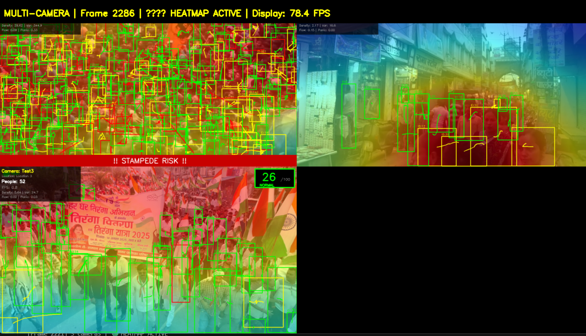
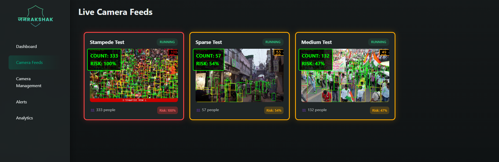
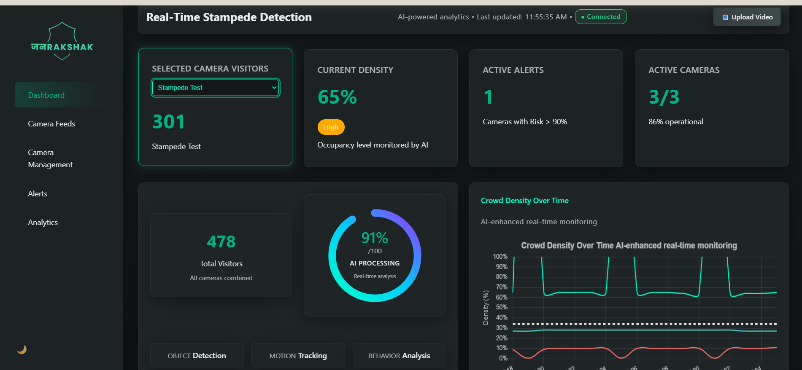
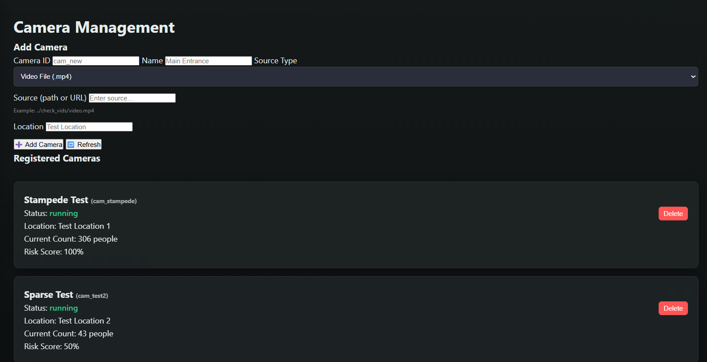

<div align="center">
   
</div>

# Stampede Rakshak
## Real-Time Crowd Monitoring, Risk Analytics, and Stampede Prevention System

---

## Overview

**Stampede Rakshak** is a real-time, multi-camera crowd intelligence platform designed to detect, analyze, and predict dangerous crowd conditions in high-density public environments. The system focuses on early identification of stampede risk by continuously analyzing crowd density, movement dynamics, spatial concentration, and temporal trends.

Rather than acting as a simple people-counting tool, Stampede Rakshak functions as a decision-support system that converts raw video streams into actionable risk insights, enabling authorities to intervene before crowd conditions escalate into emergencies.

The platform is suitable for deployment in religious gatherings, festivals, stadiums, transport hubs, urban events, and other large-scale public venues.

---

## Key Objectives

- **Continuous monitoring** of crowd conditions across multiple cameras
- **Early detection** of abnormal crowd behavior and congestion
- **Short-horizon risk forecasting** to anticipate escalation
- **Area-level and camera-level analytics** for situational awareness
- **Reliable operation** under real-time constraints

---

## Core System Capabilities

### Real-Time People Detection
- Uses YOLOv8 for high-speed and accurate person detection.
- Supports both sparse scenes and ultra-dense crowds (200–500+ individuals per frame).
- Adaptive detection parameters dynamically adjust confidence and IoU thresholds based on estimated crowd density.
- Optimized to minimize false positives while preserving recall in dense conditions.

### Multi-Object Tracking and Motion Analysis
- Persistent identity tracking using ByteTrack / BoT-SORT.
- Maintains consistent IDs across frames, even under partial occlusion.
- Enables extraction of motion features such as velocity, acceleration, and direction consistency.
- Forms the foundation for higher-level crowd behavior analysis.

### Temporal Heatmaps and Spatial Density Modeling
- Generates time-decayed heatmaps that represent spatial crowd concentration over time.
- Highlights persistent congestion zones rather than transient detections.
- Supports identification of bottlenecks, detection of crowd compression regions, and visualization of movement flow patterns.
- Heatmaps are updated continuously and decoupled from display frame rate to ensure accuracy.

### Crowd Metrics and Risk Scoring
The system computes multiple crowd-level metrics per camera and per area, including:
- Crowd density (people per unit area)
- Local density variance (uneven crowd distribution)
- Inter-person compression (average nearest-neighbor distance)
- Velocity variance (movement instability)
- Direction entropy (loss of coordinated flow)
- Flow collision indicators (opposing movement patterns)
- Panic wave indicators (sudden collective acceleration)

#### Risk Score Computation
- Metrics are combined using a weighted scoring model.
- Temporal smoothing prevents oscillations and false alarms.
- Risk scores are normalized to a 0–100 scale.
- Risk states are classified as: **NORMAL**, **WARNING**, **CRITICAL**
- This approach ensures that risk reflects crowd dynamics, not just raw headcount.

### Risk Prediction and Forecasting

#### Short-Horizon Risk Forecasting
Stampede Rakshak includes a short-term forecasting component designed to predict crowd risk trends for the next 30 minutes.

The forecasting logic is based on:
- Recent risk score gradients
- Crowd growth rates
- Velocity and compression trends
- Historical patterns at similar times and days

The prediction model is trend-based and explainable, prioritizing stability and interpretability over black-box complexity.

#### Prediction Output
Forecast results include:
- Expected risk score range
- Direction of change (increasing, stable, decreasing)
- Confidence score based on data consistency
- Basis of prediction (recent trends, historical baseline)

This allows operators to understand why a forecast was generated.

### Anomaly Detection
The system continuously scans for unusual crowd behavior using statistical techniques:
- Rolling window z-score analysis
- Sudden spike detection (large percentage changes over short intervals)
- Deviation from historical baselines for the same time-of-day

Detected anomalies are:
- Timestamped
- Classified by severity
- Logged independently from risk scores

This enables early detection of unexpected surges even when absolute crowd size is not yet high.

### Area-Based and Context-Aware Analytics
- Cameras can be grouped into logical areas (e.g., temple zone, entrance corridor).
- Area-level metrics aggregate camera data while preserving individual camera integrity.
- Contextual modifiers can be applied, such as rush-hour sensitivity, zone classification, or event-specific profiles.
- Area risk is computed conservatively to avoid masking localized danger.

---

## Analytics and Insights Layer

The analytics subsystem transforms stored metrics into long-term insights via dedicated APIs.

**Supported Analytics:**
- Crowd growth and decline trends
- Peak hour detection
- Daily and weekly behavior patterns
- Period-over-period comparisons (today vs yesterday, area vs area)
- Risk trend visualization
- Anomaly history analysis

Analytics queries operate on aggregated data to ensure scalability and performance.

---

## System Architecture

### Processing Pipeline

```
Camera Streams
   → Person Detection (YOLOv8)
   → Multi-Object Tracking
   → Motion Feature Extraction
   → Crowd Metrics & Heatmaps
   → Risk Scoring & Prediction
   → Alerts & Analytics APIs
```

### Data Flow

```
Live Metrics (1 Hz)
   → MongoDB (Raw Metrics, TTL)
   → Hourly Aggregation Jobs
   → Analytics Engine
   → REST / WebSocket APIs
   → Frontend Dashboard
```

---

## Technology Stack

### Backend
- Python
- FastAPI
- WebSocket for real-time metrics
- MongoDB for metrics and analytics storage
- Background schedulers for aggregation jobs

### Computer Vision
- YOLOv8 (Ultralytics)
- ByteTrack / BoT-SORT
- OpenCV, NumPy

### Frontend
- HTML, CSS, JavaScript
- Chart.js for data visualization
- MJPEG streaming for live video feeds

### Data Management and Reliability
- Raw per-second metrics retained for short-term analysis (TTL-based).
- Aggregated hourly analytics retained for long-term insights.
- Graceful degradation ensures real-time monitoring continues even if database persistence is temporarily unavailable.
- Health monitoring endpoints expose system status, queue backpressure, and dropped metrics.

---

## Screenshots


<div align="center">
   
   <br/>
   
   <br/>
   
   
</div>

---

## Use Cases

- Religious gatherings and pilgrimages
- Stadiums and sports events
- Metro stations and transport hubs
- Urban festivals and public rallies
- Airports and large terminals

---

## Disclaimer

Stampede Rakshak is intended as a decision-support system. Final operational decisions should always be made by trained personnel following established safety protocols.

---

## Summary

Stampede Rakshak provides a comprehensive approach to crowd safety by combining real-time detection, behavioral analytics, spatial awareness, and short-term risk forecasting. The system is designed to move beyond reactive monitoring and support proactive crowd risk management.

---

## Workflow: Setting Up Stampede Rakshak

1. **Clone the repository:**
   ```bash
   git clone https://github.com/your-org/stampede-rakshak.git
   ```
2. **Install backend dependencies:**
   ```bash
   cd backend
   pip install -r requirements.txt
   ```
3. **Start the backend server:**
   ```bash
   uvicorn app.main:app --reload
   ```
4. **Open the frontend dashboard:**
   - Open `frontend/complete_frontend/index.html` in your browser.

---

## License
This project is licensed under the MIT License.

---

> **Note:**
> The risk prediction engine uses a proprietary, explainable temporal-spatial forecasting algorithm that analyzes historical crowd density, movement vectors, and anomaly patterns to provide a 30-minute risk forecast. This predictive capability is unique to Stampede Rakshak and is continuously improved with real-world data.
"""
